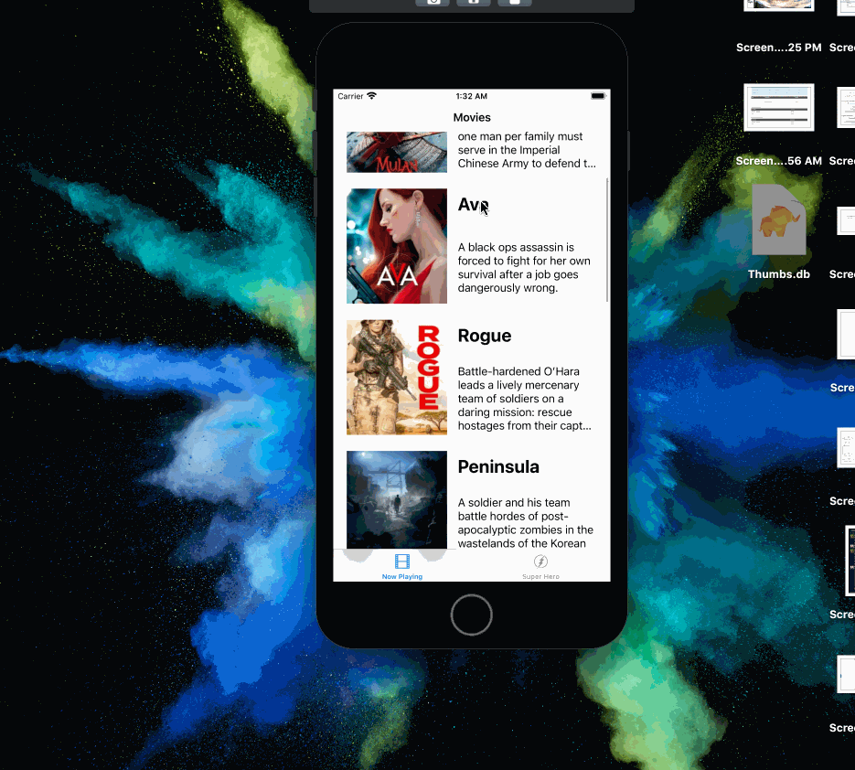
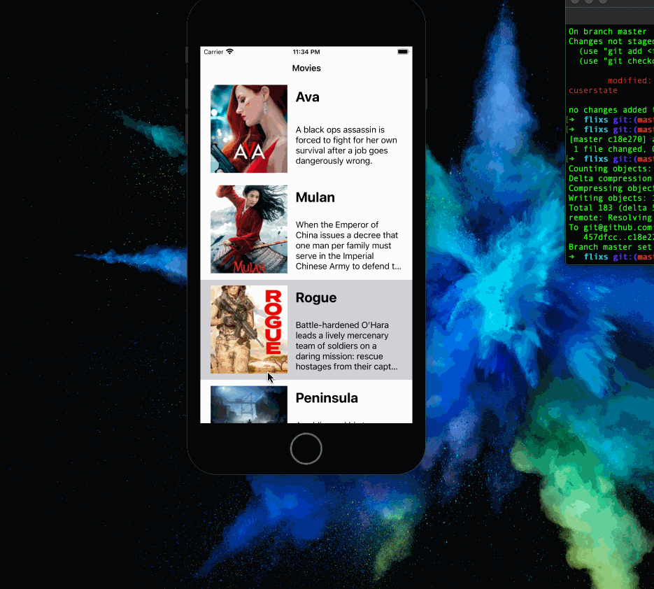

# Flix

Flix is an app that allows users to browse movies from the [The Movie Database API](http://docs.themoviedb.apiary.io/#).

## Flix Part 2

### User Stories

#### REQUIRED (10pts)
- [ ] (5pts) User can tap a cell to see more details about a particular movie.
- [ ] (5pts) User can tap a tab bar button to view a grid layout of Movie Posters using a CollectionView.

#### BONUS
- [ ] (2pts) User can tap a poster in the collection view to see a detail screen of that movie.
- [ ] (2pts) In the detail view, when the user taps the poster, a new screen is presented modally where they can view the trailer.

### App Walkthrough GIF
`TODO://` Add the URL to your animated app walkthough `gif` in the image tag below, `YOUR_GIF_URL_HERE`. Make sure the gif actually renders and animates when viewing this README. (🚫 Remove this paragraph after after adding gif)

 

### Notes
I had a hard time with this. At first I was able to get the grid view going with movies, but then I changed the size of my uiimageview and ran it again and it gave this error 
cell.posterView.af.setImage(withURL: posterUrl!) Fatal error: Unexpectedly found nil while implicitly unwrapping an Optional value: file flixs/MovieGridViewController.swift, line 59
---

## Flix Part 1

### User Stories
`TODO://` In the **User Stories section below**, add an `x` in the `-[ ]` like this `- [x]` for any user story you complete. (🚫 Remove this paragraph after checking off completed user stories)

#### REQUIRED (10pts)
- [x] (2pts) User sees an app icon on the home screen and a styled launch screen.
- [x] (5pts) User can view and scroll through a list of movies now playing in theaters.
- [x] (3pts) User can view the movie poster image for each movie.

#### BONUS
- [ ] (2pt) User can view the app on various device sizes and orientations.
- [ ] (1pt) Run your app on a real device.

### App Walkthrough GIF
`TODO://` Add the URL to your animated app walkthough `gif` in the image tag below, `YOUR_GIF_URL_HERE`. Make sure the gif actually renders and animates when viewing this README. (🚫 Remove this paragraph after after adding gif)

 

### Notes
Describe any challenges encountered while building the app.

-- while builiding, I kept forgetting to connect the viewController to the view so when I would run my app, the screen would be empty or the rows would have no data, thus causing me to start over because I didn't know where I went wrong lol.
